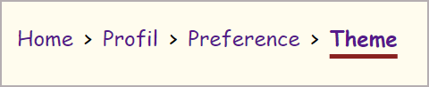

# breadcrumb-fil-dariane

This package was created with the purpose of simplifying the implementation of an accessible and customizable breadcrumb/ariane thread  




## Getting Started

Install this package:

```shell
npm add breadcrumb-fil-dariane@1.1.3
```

Import the Counter component:

```js
import { Breadcrumb } from "breadcrumb-fil-dariane";
```

You can integrate this component as a simple React component.

## Usage

```js
    return (
        <Breadcrumb pathArray={myPathArray}/>
    );
```

## Expected parameters

An array of objects containing 'path', which represents the route, and 'breadcrumb', which is the name to display in the breadcrumb.  
It should be implemented for all the website's routes and set to "null" if you don't want a breadcrumb to be displayed for that route.  

```js
    const myPathArray = [
        { path: '/', breadcrumb: 'Home' },
        { path: '/about', breadcrumb: 'About' },
        { path: '/login', breadcrumb: 'Login' },
        { path: '/contact', breadcrumb: 'Contact' }, 
        { path: '/contactList', breadcrumb: null }
    ]
```

## Usage with parameters

```js
const Component = () => {
    const myPathArray = [
        { path: '/', breadcrumb: 'Home' },
        { path: '/about', breadcrumb: 'About' },
        { path: '/login', breadcrumb: 'Login' },
        { path: '/contact', breadcrumb: 'Contact' }, 
        { path: '/contactList', breadcrumb: null }
    ]

    return (
        <Breadcrumb pathArray={myPathArray}/>
        // rest of your component
    );
}

export default Component;
```

## Customize your breadcrumb

Here is a basic customization example. You can adjust the styles to match your branding guidelines.  

```css
.breadcrumbs__list {
    padding: 1rem;
    justify-content: start;
    display: flex;
    flex-wrap: wrap;
    gap: 0.5rem;
    color: #000;
    font-size: 1rem;
    align-items: center;
}
.breadcrumbs__list__element {
    display: flex;
    gap: 0.5rem;
}
.breadcrumb-active {
    text-decoration: underline 3px #892121;
    text-underline-offset: 6px;
    font-weight: bold;
}
.breadcrumb-not-active {
    text-decoration: none;
}

```